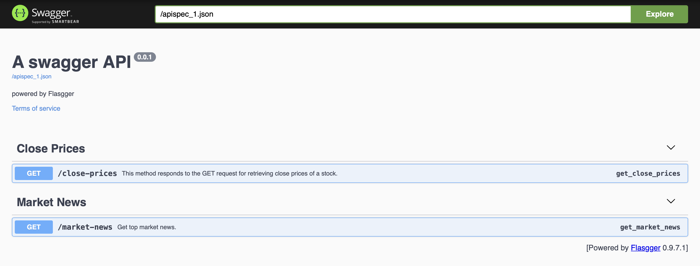

# NSE - Stock List and Comapny News


This API allows users to retrieve information about a stock using its ticker symbol.

## Base URL

The base URL for this API is `https://news-closeprice-api.onrender.com/apidocs/`

## Endpoints

### Close Prices

- **URL:** `/close-prices`
- **Method:** `GET`
- **Description:** Retrieves information regarding the closing prices ( last 6 months ) using its ticker symbol.
- **Query Parameters:**
  - `ticker` (required): The stock symbol (ticker) for which information is requested.
- **Responses:**
  - `200 OK`: Successful response containing information about the specified stock.
  - `400 Bad Request`: Indicates that the provided stock symbol is invalid or not found.
  - `500 Internal Server Error`: Indicates an issue with retrieving stock information.
 
### Market News

- **URL:** `/market-news`
- **Method:** `GET`
- **Description:** Retrieves news related to ocmpanies using its ticker symbol.
- **Responses:**
  - `200 OK`: Successful response containing information about the specified stock.
  - `400 Bad Request`: Indicates that the provided stock symbol is invalid or not found.
  - `500 Internal Server Error`: Indicates an issue with retrieving stock information.


### Example

**Response for close prices:**
```json
{
  "close_prices": {
    "2023-09-01": 3354.93310546875,
    "2023-09-04": 3393.950927734375,
    "2023-09-05": 3404.722900390625,
    "2023-09-06": 3405.26904296875,
    "2023-09-07": 3430.43701171875,
    "2023-09-08": 3417.1826171875,
    "2023-09-11": 3455.654541015625,
    "2023-09-12": 3555.08544921875,
    "2023-09-13": 3542.228515625,
    "2023-09-14": 3534.484375
  }
}
```

**Response for market news:**
```json
[
  {
    "img_url": "https://www.livemint.com/lm-img/img/2024/03/02/90x90/3-0-86449917-iStock-1167137273-0_1679792587527_1709351933928.jpg",
    "text": "Info Edge shares drop 3% as Google removes its mobile apps from Play Store",
    "url": "https://www.livemint.com/market/stock-market-news/info-edge-india-share-price-drops-3-as-google-removes-its-mobile-apps-from-play-store-11709351876978.html"
  },
  {
    "img_url": "https://www.livemint.com/lm-img/img/2024/03/01/90x90/2-0-90037833-BSE-GFX-4C--0_1681731845111_1709324481013.jpg",
    "text": "Indian stock market: 5 key things that changed for market over the weekend",
    "url": "https://www.livemint.com/market/stock-market-news/indian-stock-market-5-key-things-that-changed-for-market-over-the-weekend-gifty-nifty-to-s-p-500-ends-at-record-11709324321570.html"
  },
  {
    "img_url": "https://www.livemint.com/lm-img/img/2024/03/02/90x90/Stock_market_today_Nifty_50_Stocks_to_Buy_or_sell_1709346231755_1709346231965.jpg",
    "text": "Day trading guide for stock market today: Nine stocks to buy or sell on Saturday",
    "url": "https://www.livemint.com/market/stock-market-news/stock-market-today-nine-stocks-to-buy-or-sell-during-special-trading-session-on-saturday-2nd-march-2024-11709346052130.html"
  }
}
